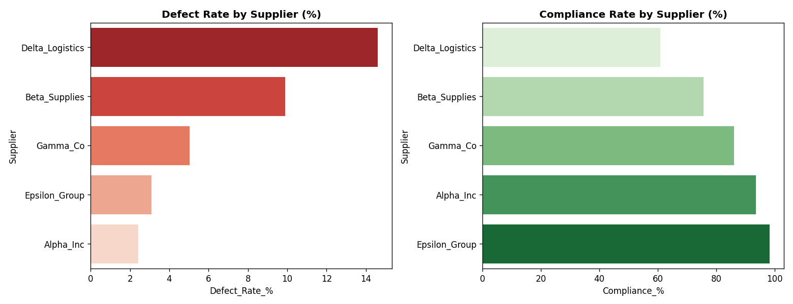

# Procurement KPI Analysis: Supplier Performance Dashboard

## 📌 Project Overview
This project analyzes a real-world procurement dataset of 777 purchase orders across 5 suppliers (2022-2023) to identify supplier performance issues in quality, compliance, and cost. The goal is to flag underperforming suppliers and support data-driven sourcing decisions.

**Dataset:** [Procurement KPI Analysis Dataset](https://www.kaggle.com/datasets/shahriarkabir/procurement-kpi-analysis-dataset) (Kaggle), 777 real anonymized purchase orders.

## 🚀 Key Findings

- **Data Cleaning:** Identified and explained missing values — 87 missing delivery dates and 136 missing defect counts, both concentrated in Cancelled/Pending orders where no delivery occurred yet (expected, not a data error).
- **Supplier Risk Flag:** Delta_Logistics has both the highest average defect rate (14.6%) and the lowest compliance rate (60.8%) among all 5 suppliers — a clear combined quality-and-compliance risk.
- **Top Performer:** Epsilon_Group leads on both quality (3.1% defect rate) and compliance (98.2%), setting the benchmark among the 5 suppliers in this dataset.
- **Cost Savings:** Negotiation reduced unit prices by 7.8%-8.2% on average across all suppliers, generating ₹39.3 lakh in total savings on ₹4.54 crore of negotiated order value. Savings are fairly uniform across suppliers — defect rate and compliance, not price, are the real differentiators.
- **Delivery Speed:** Average lead time ranges narrowly from 9.9 to 11.2 days across suppliers — not a major distinguishing factor in this dataset.

## 📊 Dashboard

## 🛠️ Tech Stack
- **Data Processing & ETL:** Python (Pandas, NumPy), SQL (SQLite)
- **Data Visualization:** Matplotlib, Seaborn
- **Analysis:** Defect rate, compliance rate, negotiation savings, and lead time computed via SQL queries and pandas aggregation

## 🔭 Next Steps
- Build an interactive Power BI dashboard on top of this cleaned dataset for drill-down by item category and time period
- Extend analysis to item-category-level defect trends
- Add statistical significance testing to confirm supplier differences aren't due to sample size variation
