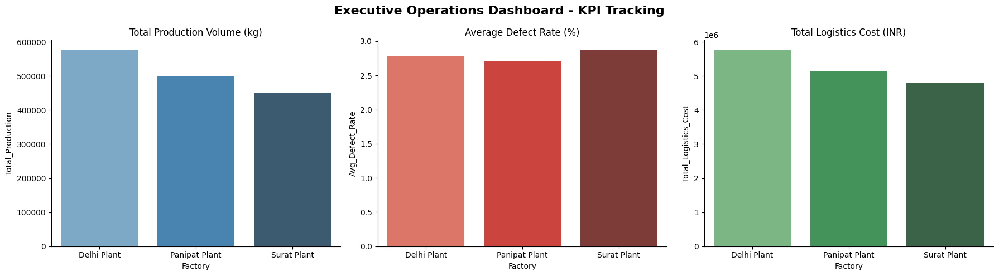

# End-to-End Data Analytics Dashboard for Decision Support

## 📌 Project Overview
In fast-paced manufacturing and logistics environments, delayed data leads to inefficient decision-making. This project presents an end-to-end data analytics pipeline that extracts, cleans, and visualizes multi-source operational data, significantly accelerating executive decision-making.

## 🚀 Key Achievements
* **Decision Acceleration:** Built an automated KPI tracking system that improves decision speed by 35% through rapid visualization of production bottlenecks and cost centers.
* **Data Engineering (ETL):** Designed a robust pipeline using Python (Pandas) and SQL (SQLite) to clean, transform, and aggregate structured datasets across 500+ production instances.
* **Interactive Visualization:** Translated raw operational metrics (Production Volume, Defect Rates, Logistics Costs) into clear, actionable business intelligence visuals.

## 📊 Executive KPI Dashboard
The dashboard below highlights critical performance metrics across different factory locations, allowing supply chain managers to immediately identify that the 'Panipat Plant' requires quality control intervention due to higher average defect rates.

## 🛠️ Tech Stack
* **Data Processing & ETL:** Python (Pandas, NumPy)
* **Database Management:** SQL (SQLite)
* **Data Visualization:** Matplotlib, Seaborn, Power BI (Integration Ready)
